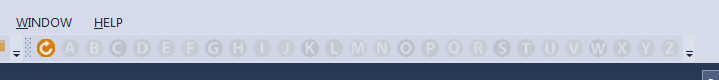

[Table of contents](_toc.md) --- [VsCommandBuddy in VisualStudio Gallery](http://visualstudiogallery.msdn.microsoft.com/f5da988e-2ec1-4061-a569-46d09733c668) 
# Customize VsCommandBuddy Alphabet toolbar

As of release 1.15, VsCommandBuddy toolbar and menu items now go the full alphabet (ie 26 items in stead of 20). 
By default, Visual Studio shows all 26 buttons in the toolbar. Unfortunately, it seems impossible to disable the buttons of a main toolbar element programmatically in the case no commands are defined. 
This may lead to a long toolbar, with 26 buttons, while probably only a few have commands defined for it.

Fortunately Visual Studio lets you, to some extend, customize toolbars. You can disable and enable buttons by hand.

Full toolbar (26 buttons):

Customized toolbar (with some buttons disabled):

This issue does not exist in the tools menu, there VsCommandBuddy only enables menuitems which are in fact defined commands.

Hope this helps!

